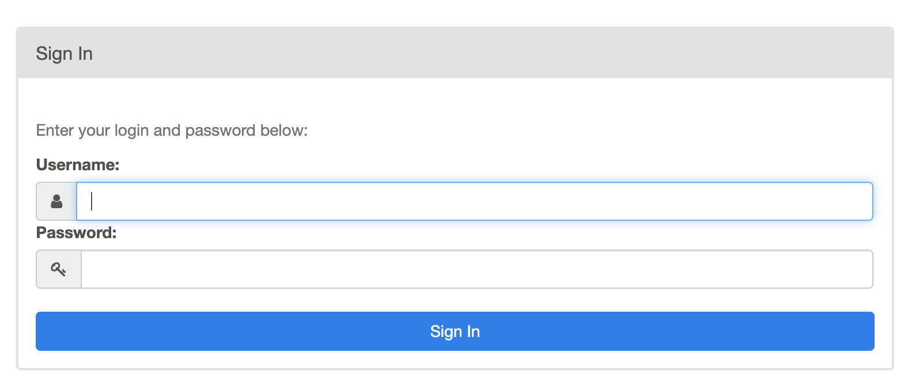

# Airflow Docker Local

Projeto para se executar o Airflow com docker-compose.

Alem de uma stack para ser possivel utilizar o scheduler localmente.

#Project structure
```
root/
├── dags/
│   └── dummy_dag.py
├── scripts/
│   └── entrypoint.sh
├── logs/
├── .env
└── docker-compose.yml
```


# Commands

## Executando projeto Docker-compose Full

```
docker-compose up postgres webserver scheduler
```

## Executando projeto Docker-compose com Scheduler Local

Execute este comando em um terminal
```
docker-compose up postgres webserver
```
Execute este comando em outro terminal, mas na pasta
deste repositorio
```
export AIRFLOW_HOME=$PWD

airflow scheduler
```

## Acessando Web

Para acessar a pagina web do airflow, acesso o localhost na porta
9998: [WEB](http://localhost:9998)

## Parando os processos

utilize o comando

```
docker-compose down
```

## Parando processo em daemon

### Scheduler

Deletando processos airflow em Daemon

```
ps aux | grep 'airflow scheduler'

kill $(ps -ef | grep "airflow scheduler" | awk '{print $2}')
```

## Varivel de ambiente Path do airflow

Variavel local para o projeto com PWD

```
export AIRFLOW_HOME=/Users/andresantosbarrosdasilva/Documents/airflow_dev
````

## Acesso ao projeto



Para acessar a pagina do airflow utilize o usuario admin e senha admin,
este usuario e criado no arquivo scripts/entrypoint.sh

```
admin:admin
```

# Criando Dags

Na pasta

```
root/
├── dags/
│   └── dummy_dag.py
```

Voce pode editar e criar dags, que serao automaticamente 
adicionadas ao projeto.

# Erros Comuns

## Erro no DockerComponent das Dags
Se ocorrer este erro ao se utilizar o DockerComponent

```
[2021-01-19 10:49:27,436] {local_task_job.py:118} INFO - Task exited with return code Negsignal.SIGABRT
```

adicione esta variavel de ambiente ao scheduler:

```
export OBJC_DISABLE_INITIALIZE_FORK_SAFETY=YES
```

## Permissao

Algum erro de permissao use:
```
chmod -R 777 scripts
```